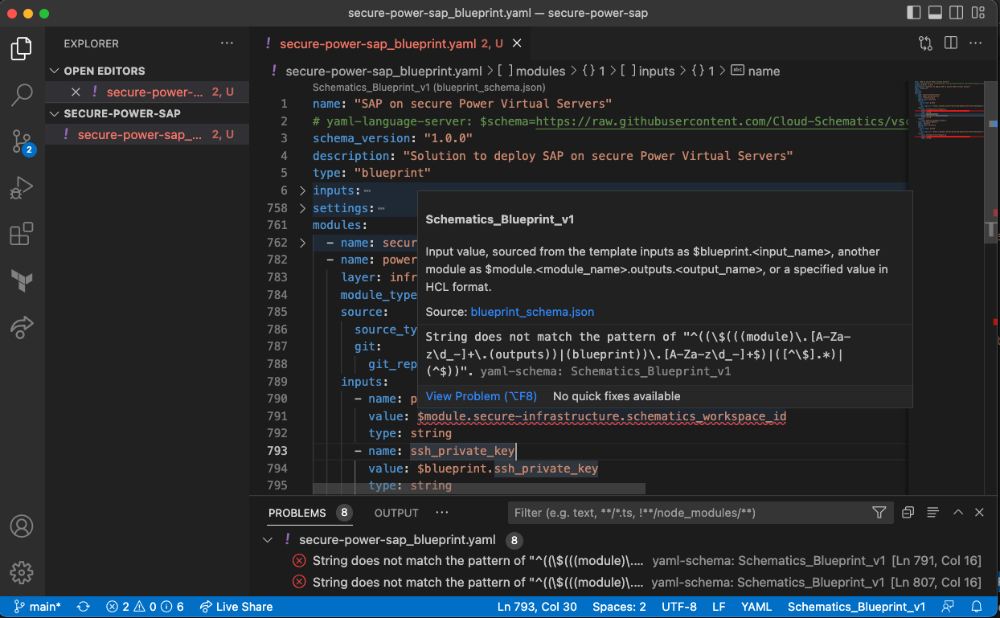
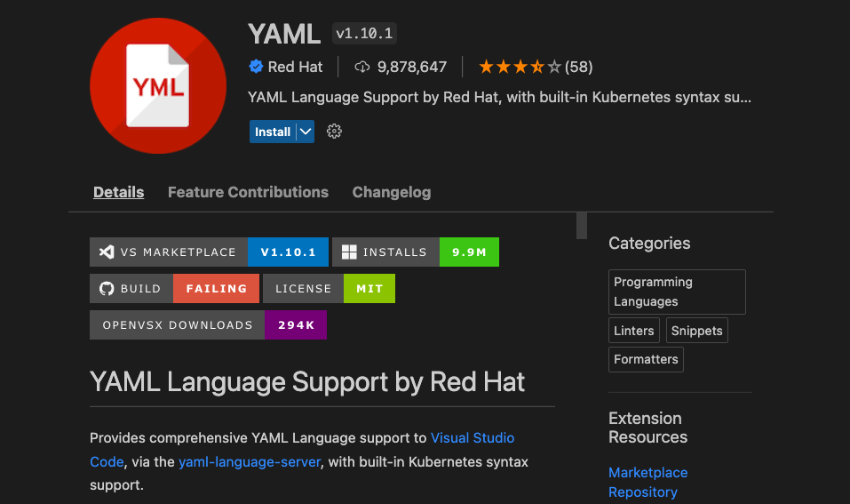
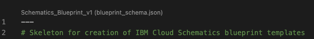

# VSCode language support for IBM Cloud Schematics Blueprints 

Create and edit blueprint templates in VSCode using the Redhat YAML language server extension and a blueprint template schema. 

The [Red Hat YAML VSCode extension](https://marketplace.visualstudio.com/items?itemName=redhat.vscode-yaml) provides a framework for editing blueprint yaml files, using a blueprint schema defined using [JSON-Schema](https://json-schema.org). 

Capabilities supported:
- YAML language support with blueprint template schema validation
  - Validation of YAML structure and blueprint keywords 
- Autocomplete
  - Auto complete for template keywords
- Hover support
  - Hovering over a keyword reveals the related schema description and links to documentation
- Outlining for complex templates  

The screenshot shows a blueprint template being edited in VSCode. The extension has identified a problem with the template at line 791. 



A validation error with the module input value is highlighted and is displayed in the problems panel. Next to the highlighted error the _hover_ provides help information for the module input field. The mini-map to the right highlights all lines with validation errors. 


<br/>

## 1. Install the Red Hat YAML Language extension 

Click on the “Extensions” button in the Activity Bar. It’s located on the side of VS Code’s client. Alternatively, you can use the keyboard shortcut “Ctrl+Shift+X” or "Cmd+Shift+X" on MacOS to open the “Extensions” screen.

This will bring you to the “Extensions” list. Type YAML in the search box and this will sort the available YAML extensions with the Red Hat extension at the top. 



Click on Install to install the extension into your workspace. 

## 2. Configuring the blueprint JSON schema

The blueprint JSON schema must be identified to VSCode. It is not automatically recognized. The association of the blueprint schema can be done either in the blueprint YAML file itself using a modeline or in the VSCode User or Workspace settings under the property `yaml.schemas`.

### Associating the schema in the blueprint YAML file
It is possible to specify the blueprint schema using a modeline in the blueprint YAML file. The blueprint schema url can be a relative path to a local file or the url of the schema in the Cloud-Schematics Github [repo](https://github.com/Cloud-Schematics/vscode-blueprint-schema).  

Cut and paste the following text into the blueprint YAML file, within the first few lines of the file. 

```
# yaml-language-server: $schema=https://raw.githubusercontent.com/Cloud-Schematics/vscode-blueprint-schema/master/blueprint_schema.json
```

### Associating the blueprint schema via user and workspace settings
Alternatively the schema can be automatically applied using file matching defined in the VSCode user or workspace settings. The `yaml.schemas` setting applies a YAML schema to a file by file matching. 

Open [user and workspace settings](https://code.visualstudio.com/docs/getstarted/settings#_creating-user-and-workspace-settings) and navigate to the extensions `yaml.schemas` section. Cut and paste the following value onto the section. The schema will be associated with all blueprint template files that end with the file pattern '*blueprint.yaml'

```
yaml.schemas: {
    "https://raw.githubusercontent.com/Cloud-Schematics/vscode-blueprint-schema/master/blueprint_schema.json": "/*blueprint.yaml"
}
```

## 3. Editing in VSCode
Open the folder containing the template repo contents as a new VSCode workspace
- Select the file `<sample-template->blueprint.yaml` for editing
- Just above the top of the file contents, the selected schema is displayed.
- Blueprint template schema

  

With the extension and schema configured, VSCode will provide assisted editing for blueprint templates. 

## 4. Sample blueprint templates

Sample templates can be found in the following repos:

[A sample template you can customize ](https://github.com/Cloud-Schematics/blueprint-sample-template)

Deployable template examples can be found in the [IBM Cloud Schematics GitHub repository](https://github.com/orgs/Cloud-Schematics/repositories/?q=topic:blueprint). 


## Schema releases 
Initial blueprint schema release
- All blueprint template keywords defined for Blueprint Schema V1.0.0 
- No conditional evaluation of sub-schemas, e.g. source_type > github/catalog is broken after release 1.2.2. of the YAML extension. https://github.com/redhat-developer/vscode-yaml/issues/769 

## Schema validation

Sample templates to validate the schema can be found in the /templates folder 

